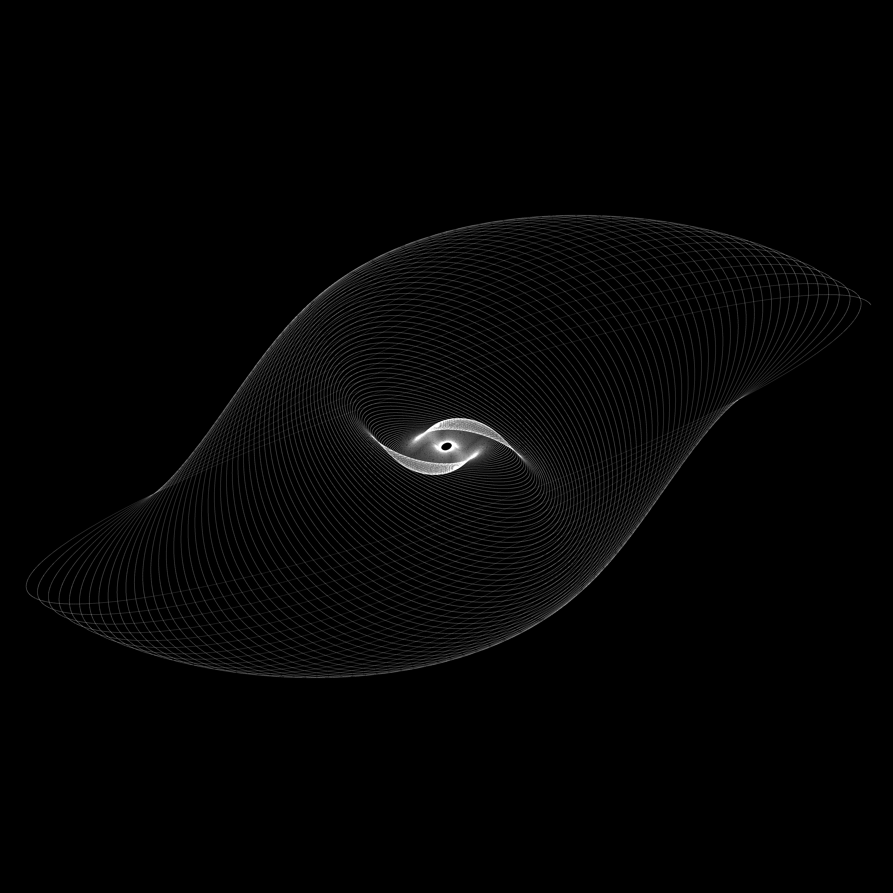
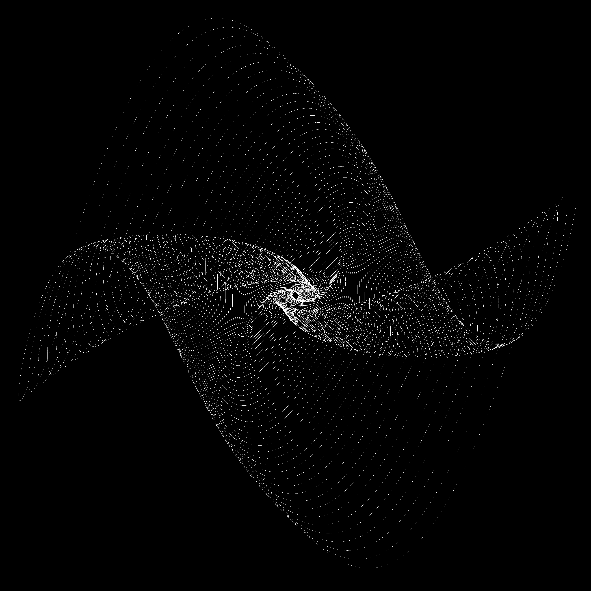
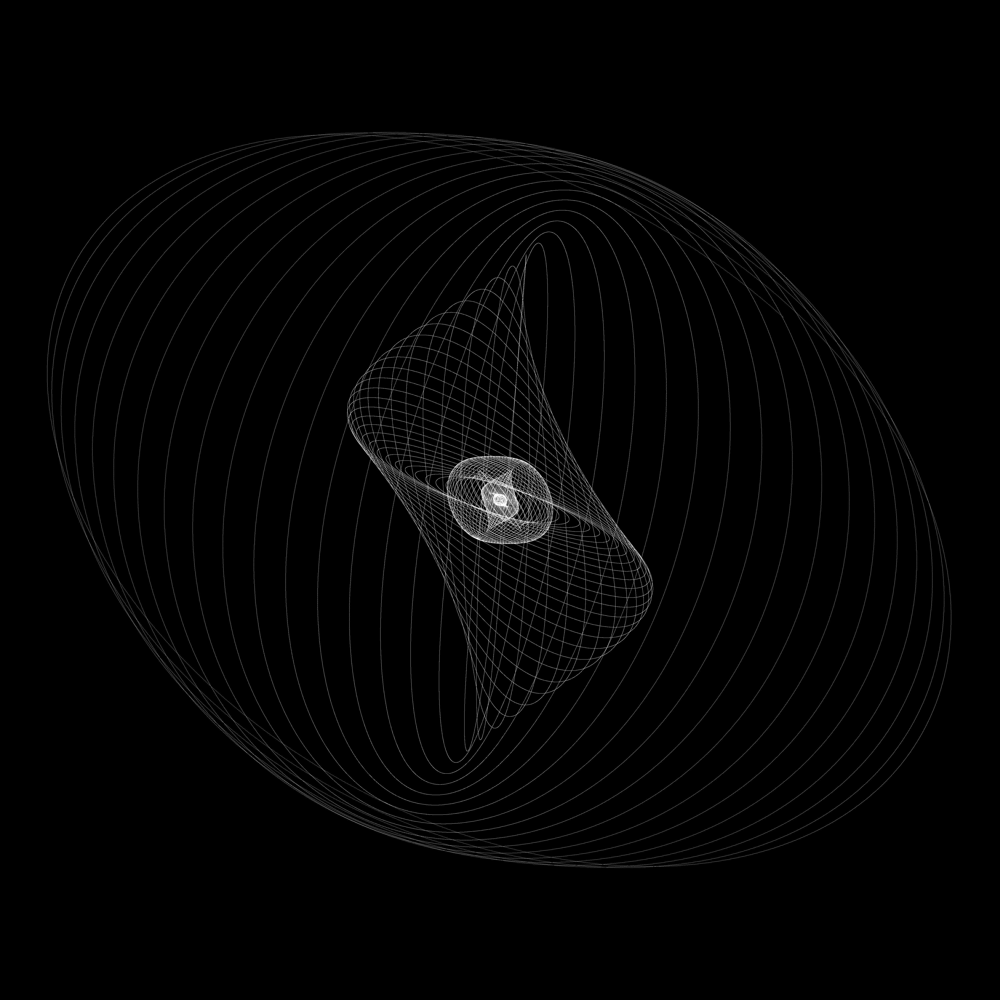

# A Harmonograph Simulation

Pictures were encoded using LodePNG [(https://github.com/lvandeve/lodepng)](https://github.com/lvandeve/lodepng)

## Sample Images

Settings:  
d_0 = 0.025 a_0 = 1200 f_0 = 4.05 p_0 = 2.42  
d_1 = 0.025 a_1 = 1200 f_1 = 4.099 p_1 = 1.41  
d_2 = 0.02 a_2 = 1200 f_2 = 3.91 p_2 = 2.5  
d_3 = 0.02 a_3 = 1200 f_3 = 4.1 p_3 = 2.48

Settings:  
d_0 = 0.015 a_0 = 1200 f_0 = 2 p_0 = 2.42  
d_1 = 0.015 a_1 = 1200 f_1 = 2 p_1 = 1.41  
d_2 = 0.02 a_2 = 1200 f_2 = 4.05 p_2 = 2.5  
d_3 = 0.02 a_3 = 1200 f_3 = 1.95 p_3 = 2.48

Settings:  
d_0 = 0.015 a_0 = 1200 f_0 = 4.05 p_0 = 1.5  
d_1 = 0.015 a_1 = 1200 f_1 = 4.05 p_1 = 0  
d_2 = 0.02 a_2 = 1200 f_2 = 4.05 p_2 = 1.76  
d_3 = 0.02 a_3 = 1200 f_3 = 4 p_3 = 2.42

Settings:  
d_0 = 0.015 a_0 = 1200 f_0 = 3 p_0 = 1.54  
d_1 = 0.015 a_1 = 1200 f_1 = 3 p_1 = 0  
d_2 = 0.02 a_2 = 1200 f_2 = 3 p_2 = 1.76  
d_3 = 0.02 a_3 = 1200 f_3 = 9.05 p_3 = 2.42  

Settings:  
d_0 = 0.015 a_0 = 1200 f_0 = 3 p_0 = 2.8  
d_1 = 0.015 a_1 = 1200 f_1 = 3.05 p_1 = 1.23  
d_2 = 0.02 a_2 = 1200 f_2 = 3.1 p_2 = 2.13  
d_3 = 0.02 a_3 = 1200 f_3 = 3.1 p_3 = 6.1  

Settings:  
d_0 = 0.015 a_0 = 1200 f_0 = 6.05 p_0 = 4.89  
d_1 = 0.015 a_1 = 1200 f_1 = 6 p_1 = 3.99  
d_2 = 0.02 a_2 = 1200 f_2 = 2 p_2 = 2.32  
d_3 = 0.02 a_3 = 1200 f_3 = 2 p_3 = 3.9
